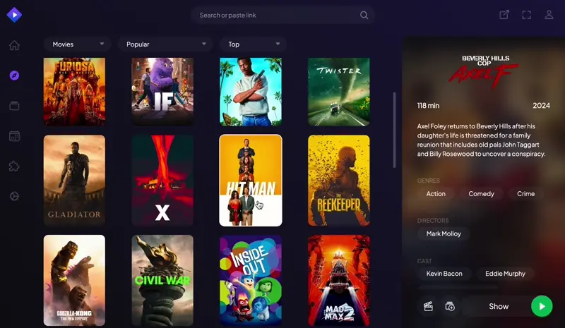

# nCore addon

A self-hostable Stremio addon that lets you stream content straight from nCore.



> **IMPORTANT:** This project is very much in its alpha phase. The setup is still a bit rough and even a full rewrite is not out of the picture. It's the early days of the project, so don't expect stability yet, but feel free to experiment with it.

> **IMPORTANT:** I maintain this project in my free time as a hobby. Feel free to leave suggestions or feedback in the form of issues, but don't _expect_ free labor. Rude and entitled issues will be deleted without explanation.

## FAQ

### What is Stremio?

<details>
<summary>
View answer
</summary>

Stremio is a media hub for your Smart TV, phone, or computer, just like Netflix, Disney+, or other services.

The differe is that Stremio doesn't provide any media sources by default, you have to use addons for that.

Learn more about Stremio [here](https://www.stremio.com/), or download the apps [here](https://www.stremio.com/downloads).

</details>

### What is this addon?

<details>
<summary>
View answer
</summary>

This project is an addon that connects your nCore account to Stremio. Without an addon, stremio will show no "streams" for any media.

Once you configure this addon, you will be able to click on any movie/show and you will see a list of all torrents for that particular media from nCore.

The addon will even rank them based on your configured preferences (language + resolution).

</details>

### What do I need to get started?

<details>
<summary>
View answer
</summary>

Most importantly, you need a working (not banned) nCore account that can download torrents.

You will need a computer/server to host this addon. The addon will run on your computer and search nCore for you. Once you start playing something, the addon will download the torrent to the computer and start seeding it.

Make sure that the computer you are using has enough free space to accommodate your downloads.

Since nCore requires you to seed content, the computer should ideally be turned on for as long as possible.

For watching the content, you will need a smart TV, Android TV box, Chromecast, or something similar. Using a PC or Mac will also work great. Stremio can work well on mobile devices, but for iOS, it might require some extra setup. You will need to download Stremio to your device and create an account.

When you are running the addon, you are essentially running a server on your computer. Your device needs to be able to access this server somehow. The easiest solution is to have the server and the client (the smart TV for example) on the same network (they need to be connected to the same router). This way, you will be able to add the addon through its local address.

You will also need to install Node.js and some sort of manager to run it continuously (pm2 is recommended).

If you do not own an Android TV / Chromecast / Firestick / Android phone or similar device, then you will need to set up HTTPS on the server's URL. This might be difficult for beginners. I'm working on an easier solution for this.

</details>

## Features

-   Self-hostable. The downloading machine can be anywhere and you can stream remotely.
-   Seeds torrents after download.
-   Saves torrent files and downloads to disk. If you come back the next day, the files will already be downloaded, so you won't have to wait too long.
-   Configurable to delete torrents when you no longer have to seed them. (Hit'n'run checker)
-   Multiple users without having to tell your nCore password to anyone.
-   Recommendations and torrent ordering based on user preferences (Language + Resolution).

## Setup

**Server**: the computer where you will host this addon.

**Client**: the device where you will watch the content through the Stremio app.

1. Clone the repository to the server.
    ```sh
    git clone https://github.com/detarkende/stremio-ncore-addon.git && cd stremio-ncore-addon
    ```
1. Install the dependencies
    ```sh
    npm install
    ```
1. Create the configuration file in the base of the project.
    ```sh
    touch config.json
    ```
    **[See configuration file reference](#configuration-file-reference)**
1. Run the start command to test if everything is good to go.
    ```sh
    npm run start
    ```
    If everything looks good, you can stop the program with `Ctrl^` + `C`.
1. Setup the program to run in the background.
   (Recommended way: using `pm2`)

    1. Install pm2:

        ```sh
        npm i -g pm2
        ```

    1. Setup pm2 to run on startup.

        ```sh
        pm2 startup
        ```

    1. Start the addon with pm2.
        ```sh
        pm2 start "npm start"
        ```
        After this, you can check the logs from the server with the `pm2 logs` command.

1. Finally, install the plugin
    <details>
    <summary>I don't have an Android TV / Chromecast or similar.</summary>

    1. Make sure that the config URL can be reached with HTTPS: `https://<ADDON-URL>/configure`. (Example: https://stremio-addon.example.com/configure)
    1. Open [Stremio on the web](https://web.strem.io/#/intro?form=login), and log in.
    1. Go to the configuration URL, log in to the addon with one of the users, then click on "Configure on the web".
    1. Click on "Install".
    1. Now you can log in on any device and the plugin will work. (Note: you might have to sync your addons first on some Smart TVs.)
     </details>

    <details>
    <summary>I have an Android TV / Chromecast or similar.</summary>

    1. Open the app and log in.
    1. Go to addons.
    1. Click on the "Add addon" button.
    1. Type in your server's address. If you have this set up to a certain URL, type that. Otherwise, just replace the parts in this: `http://<SERVER_IP_ADDRESS>:<PORT>/manifest.json`. (Example: https://192.168.0.110:3000/manifest.json)
    1. Click "Configure" and wait for the configuration window to open.
    1. Log in with one of the users you saved in your config file.
    1. Click on "Configure".
    1. You should be redirected to the Stremio Addons screen. Click "Install" to finish the installation.
     </details>

## Configuration file reference

| Property                                      | Type                | Required | Default value         | Description`                                                                                `                                                                                                           |
| --------------------------------------------- | ------------------- | -------- | --------------------- | ------------------------------------------------------------------------------------------------------------------------------------------------------------------------------------------------------- |
| `port`                                        | `number`            | Optional | 3000                  | Port number where the server will run.                                                                                                                                                                  |
| `download_dir`                                | `string`            | Required | -                     | Directory path where the video files will be downloaded to.<br> Should be an empty directory.<br> If the given path doesn't exist, it will be created.                                                  |
| `torrents_dir`                                | `string`            | Required | -                     | Directory path where the torrent files will be downloaded to.<br> Should be an empty directory.<br> If the given path doesn't exist, it will be created.                                                |
| `secret`                                      | `string`            | Required | -                     | Unique secret that will be used for safe authentication.<br> **This should be a randomly generated string. It doesn't have to be memorable**<br> Generate one [here](https://randomkeygen.com/#504_wpa) |
| `addon_url`                                   | `string`            | Optional | http://localhost:3000 | Full URL of the web server (with port number if necessary).<br> This needs to be accessible by the Stremio client.                                                                                      |
| `ncore`                                       | `object`            | Required |                       |                                                                                                                                                                                                         |
| `ncore.url`                                   | `string`            | Optional | https://ncore.pro     | URL of the nCore website. This is only here in case the URL changes.<br> Otherwise, you don't need to provide this.                                                                                     |
| `ncore.username`                              | `string`            | Required | -                     | Your username for nCore.                                                                                                                                                                                |
| `ncore.password`                              | `string`            | Required | -                     | Your password for nCore.                                                                                                                                                                                |
| `ncore.delete_torrents_after_hitnrun`         | `object`            | Optional |                       |                                                                                                                                                                                                         |
| `ncore.delete_torrents_after_hitnrun.enabled` | `boolea`n           | Optional | false                 | Enable automatic deletion of torrents that are not mandatory to seed anymore.                                                                                                                           |
| `ncore.delete_torrents_after_hitnrun.cron`    | `string`            | Optional | `0 2 * * *`           | Cron expression for running the hitnrun table check. Defaults to "Once every day at 2:00 AM"                                                                                                            |
| `users`                                       | `Array<object>`     | Required |                       |                                                                                                                                                                                                         |
| `users[].username`                            | `string`            | Required | -                     | Username for a given user of the addon.                                                                                                                                                                 |
| `users[].password`                            | `string`            | Required | -                     | Pasword for a given user of the addon.                                                                                                                                                                  |
| `users[].role`                                | `'admin' \| 'user'` | Optional | user                  | The role of a given user of the addon.                                                                                                                                                                  |
| `users[].preferences`                         | `object`            | Required |                       |                                                                                                                                                                                                         |
| `users[].preferences.first_preferred_lang`    | `string`            | Required | -                     | Preferred language of the given user of the addon.<br> This setting will be used to rank and order the found torrents and for giving recommendations.                                                   |
| `users[].preferences.second_preferred_lang`   | `string`            | Optional | -                     | Second preferred language (preferred if the first isn't available) of the given user of the addon.<br> This setting will be used to rank and order the found torrents and for giving recommendations.   |
| `users[].preferences.preferred_resolutions`   | `Array<string>`     | Required | -                     | A list of resolutions that the user prefers in preferential order.<br> This setting will be used to rank and order the found torrents and for giving recommendations.                                   |

### Example `config.json`

```json
{
	"port": 3000,
	"download_dir": "/media/share/downloads",
	"torrents_dir": "/media/share/torrents",
	"secret": "REPLACE_ME",
	"addon_url": "https://stremio-ncore-addon.example.com",
	"ncore": {
		"url": "https://ncore.pro",
		"username": "NCORE_USERNAME",
		"password": "NCORE_PASSWORD",
		"delete_torrents_after_hitnrun": {
			"enabled": false,
			"cron": "0 2 * * *"
		}
	},
	"users": [
		{
			"username": "ADMIN_USERNAME",
			"password": "ADMIN_PASSWORD",
			"role": "admin",
			"preferences": {
				"first_preferred_lang": "Hungarian",
				"second_preferred_lang": "English",
				"preferred_resolutions": ["720P", "1080P"]
			}
		}
	]
}
```
