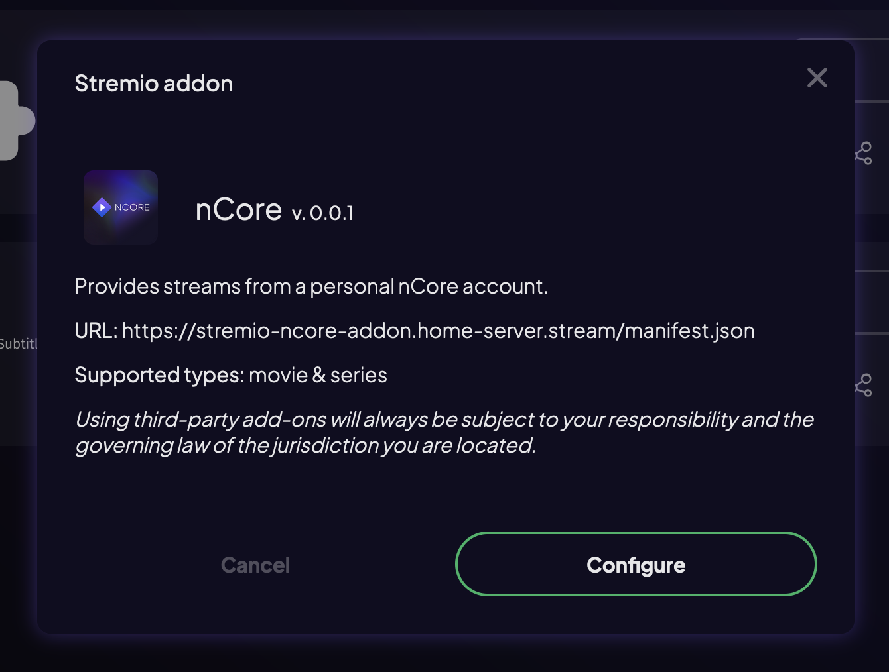
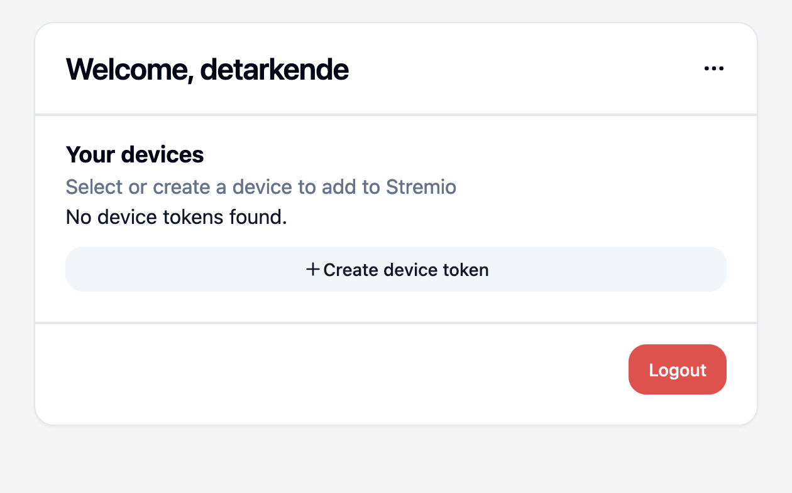
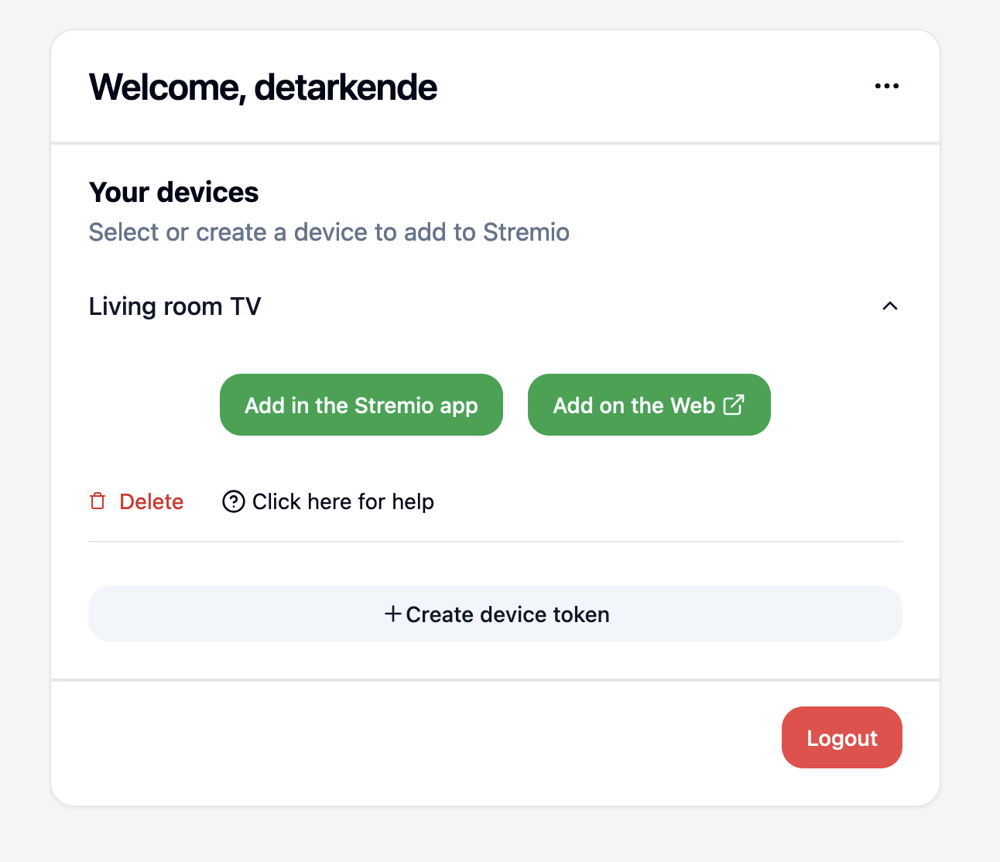
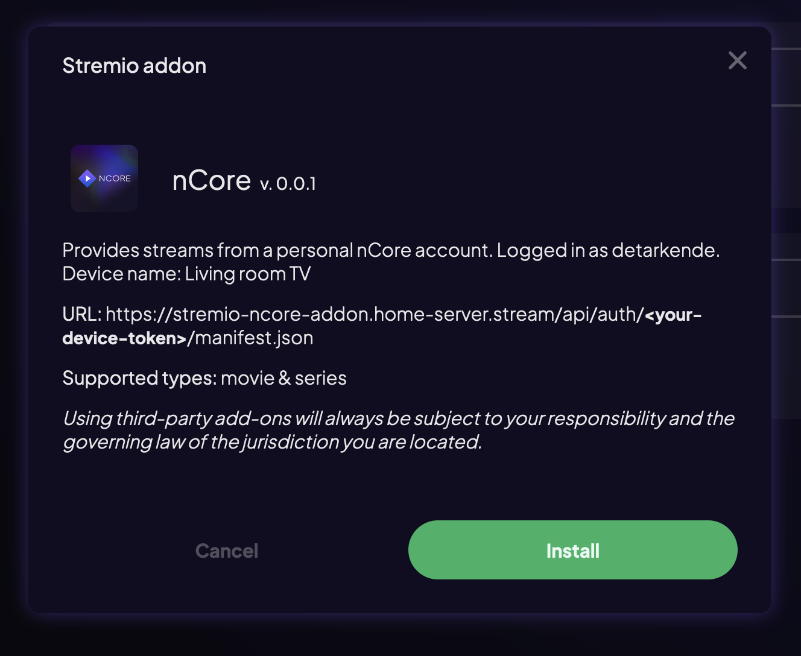
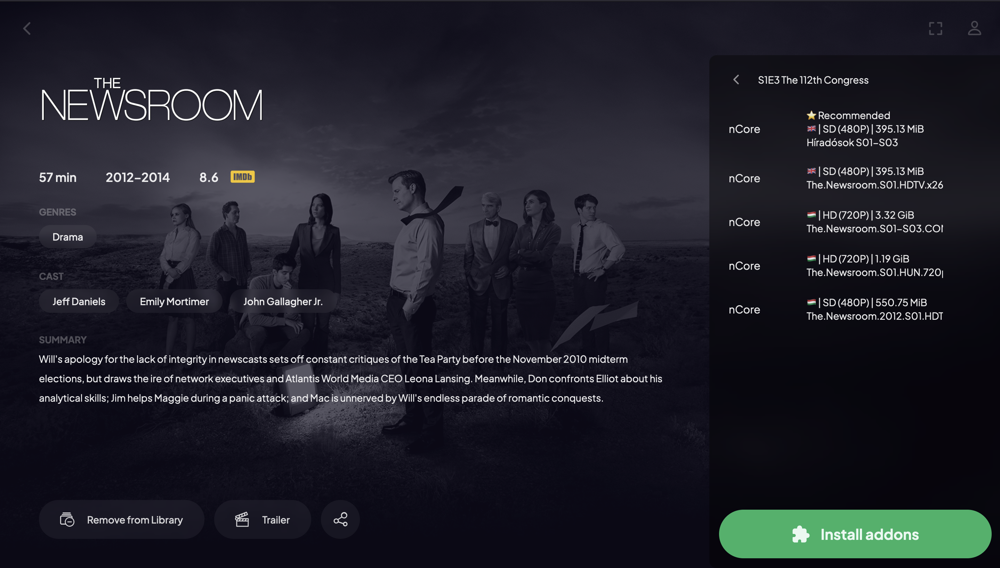

# Client setup

This guide will help you add the addon to Stremio.

## Step 1 - Add on Stremio

Open Stremio on your device. This can be an Android TV, LG TV, Samsung TV, a web browser, or any other supported device.

Once you are signed in, go to the "Addons" tab.

Click the "**Add addon**" button. If you don't see this button, or see a message urging you to install the addon on a different device, then you should add the addon from a web browser. In this case you will need to go to [https://web.stremio.com](https://web.stremio.com/#/addons).

In the dialog type in your **Addon URL** + `/manifest.json`.

_If you configured your own URL, then this will look something like `https://stremio-ncore-addon.mydomain.com/manifest.json`._

_If you chose the "Local only" configuration, then this will look something like `https://192-168-0-114.local-ip.medicmobile.org`._

Click on "Add", then you should see this:

Click on "**Configure**".

## Step 2 - Login to the addon

Now you should see your addon popping up (On Android it's in a mini window, while in the browser it will open a new tab).

Sign in with an account. If you're setting this up for a non-admin user, use their login credentials.

## Step 3 - Create a device token

You should see something similar to this:

Right now, you don't have any device tokens, so we need to create one for this device. If you're setting up your bedroom TV, then you should give the token a name like "Bedroom TV".

To do this, click on "Create device token" and fill the name.

Now you should see something like this:

## Step 4 - Add to Stremio

If you got here from the Android or Mac/Windows native apps, then you should click on "**Add in the Stremio app**".

Otherwise, if you got here in a web browser, then click on "**Add on the Web**".

## Step 5 - Finish setup

This should redirect you back to Stremio, where you should click on "**Install**" in the opened dialog.

## Done! 🎉

You can now use the addon from this device.

