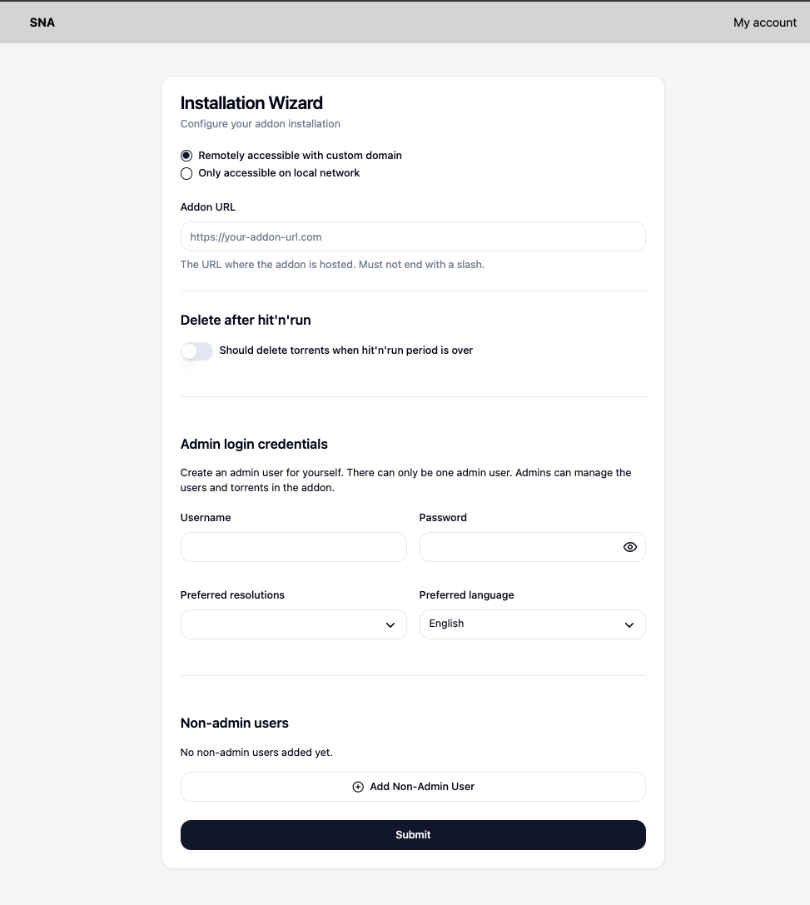

# Addon settings and initial setup

## Initial setup

The first time you start your addon, you will see this settings screen.

This guide shows you how to set things up.

### Setup mode and Addon URL

Here, you have to pick whether you want to setup the addon with your own addon URL (remotely accessible), or in a "local-only" mode. Don't worry, you can change this later.

#### Remotely accessible with custom domain

The addon URL is an URL where your addon is reachable by Stremio clients. If you followed the beginner's guide, this should be `https://stremio-ncore-addon.<your-domain.name>`.

> [!IMPORTANT]
> The Addon URL's protocol should be https, because some Stremio clients (LG TV app, Samsung TV app, Web Client, etc.) can not reach http URLs.
> If you can't add your URL to Stremio, this is the most likely cause of that.

#### "Local-only" mode

If you select the "Only accessible on local network" button, then the input field below will change to an IP address input.

Here, you will have to input the IP address of the host machine. This IP address should be static. Please follow the ["local-only" guide](../beginners/local-only.md) to set this up. Your IP address will most likely look something like _`192.168.1.202`_.

Later, when adding the addon to Stremio, the addon will generate your "Addon URL" based on this IP address. You can always change this on the "Settings" page.

### Delete after hit'n'run

On nCore you need to seed torrents for a set amount of time. If you stop seeding before this time, that's called a hit'n'run and it can get your nCore account banned.
To avoid this, SNA seeds your torrents for you after you download them.
If you want to save space on your server, then you might want to delete the torrents that don't need to be seeded anymore.

If you turn this toggle on, then the addon will periodically check which torrents can be safely deleted from your drive.
You have to provide a cron expression to make this work, but the default value might be good enough for you.

The default value checks your torrent every day at 2 AM in the morning. You can [click here](https://crontab.guru/#0_2_*_*_*) to generate a custom cron expression

You can also delete your downloads manually, so you don't have to turn this on if you don't want to.

### Admin login credentials

You need to create an admin account for yourself that will manage other users, the addon settings and the downloads.

Give this account a username and password, that you can use to sign in.

#### Preferred resolutions

The addon will try to determine the resolution of torrents by their release name.

You have to select multiple resolutions, to tell the addon what to look for when sorting torrents.

Torrents with your preference will be sorted to the top of the list in Stremio, and the best option for you will be marked with a "**⭐️ Recommended**" tag.

#### Preferred language

The addon will try to determine the language of torrents by their release name and torrent category.

You have to select the language that you want to watch media in.

> [!IMPORTANT]
> Some torrents will be flagged as Hungarian, but they might also contain English sound tracks as well as Hungarian. We will try to make this as straightforward as possible in the future for users.
> As a general guideline, pick the "Recommended" torrent by default, and if you need to search for another one, check the torrent release names, they will usually contain words like "ENG", "HUN", etc.

> [!TIP]
> On nCore, "English" usually means original language, so if you find a German show for example, that will also be flagged as English.
> Keep this in mind and always read the torrent's name for more info.

Torrents with your preference will be sorted to the top of the list in Stremio, and the best option for you will be marked with a "**⭐️ Recommended**" tag.

### Non-admin users

Non-admin users are regular users of the addon. They can only sign in, add the addon to their Stremio and change their own account settings.

Same guidelines apply here as with admin user preferences.

You can always create new users later in the Settings and remove existing users.

As an admin, you can also change your user's preferences. This can be useful with less technical friends and family when they have issues.

## Settings

As an admin user, after logging in, you can

- edit the addon settings,
- add or remove users,
- update user account details, preferences or passwords

on the Settings page.
