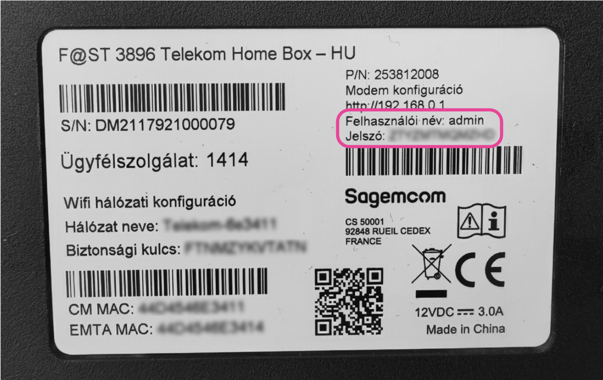
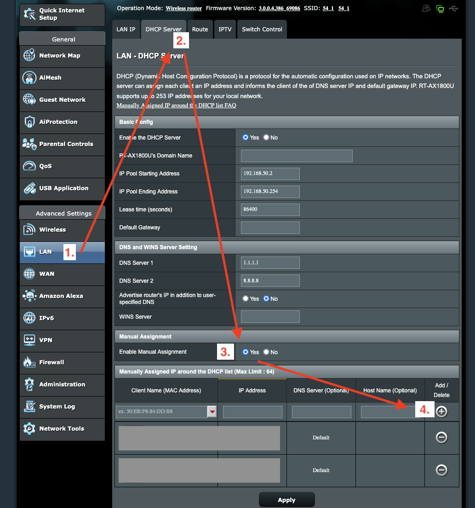

# Beginner installation guide

This installation guide will guide you through the recommended installation process for beginners.

If you are not experienced with selfhosting, then this is the guide for you.

> [!IMPORTANT]
>
> This guide will only enable you to use the addon inside your home network.
> If you want to share the addon with friends and/or family, then you need to follow the [Remote](./remote-with-domain.md) guide.
>
> You can change your mind later and switch between the two.

## Step 1 - Set up a server

You need to have a server that will download and stream the content for you. Don't worry, you don't need anything fancy, an old PC or a Raspberry Pi will be perfectly fine.

First, you need to install Linux on this computer.

If you have a Raspberry pi, then I recommend following [this guide](https://www.raspberrypi.com/documentation/computers/getting-started.html).

If you are using a regular PC as your server, then I recommend installing Ubuntu through [this guide](https://ubuntu.com/tutorials/install-ubuntu-desktop).

## Step 2 - Install CasaOS

Once you have your server set up correctly and it is connected to your router, it's time to install CasaOS on it.

Open the terminal on your server machine.

Type the following command into the terminal:

```sh
curl -fsSL https://get.casaos.io | sudo bash
```

It might ask you for your password (If you type in your password, but nothing changes on the screen, don't worry, things are still happening, the system is simply hiding your password).

I recommend watching this [video by BigBearTechWorld](https://youtu.be/aNjMFI3e-14?si=ZbRi1jnYueBdAePU&t=188) if you would like a video guide.

## Step 3 - Set a static IP for your server in your router

Your router likely uses a protocol, called DHCP. All this means is that whenever you connect to the router (e.g. your computer or the router restarts), you might get a new local IP address. This is not good for us, so we need to make sure that your computer always gets the same local IP address.

Every router is different, so you might have to do some Google searching.

### Step 3.1 - Find your router's admin panel and log in

Most routers have a web admin interface at [http://192.168.0.1](http://192.168.0.1), or [http://192.168.1.1](http://192.168.1.1). If yours is not there, then you can usually find the address on the back of your router, along with the necessary admin credentials.



Go to this address, and use your credentials to log in.

### Step 3.2 - Find the DHCP - manual IP assignment menu

I can't tell you how to find it on your router model, but here's how you find this menu on an ASUS router:



Select your device, then assign an IP address to it. (Usually, the menu will select the current IP of the device, which is fine for us).

**Write down this IP address in a text file or a piece of paper.**

Apply the settings and potentially wait for the router to restart.

## Step 4 - Install Stremio nCore addon in CasaOS.

Back on the CasaOS Dashboard, click the Plus icon and add a customized app.

Click on the import button, then import the following configuration text.

<details>
<summary>View config text</summary>

```yml
name: stremio-ncore-addon
services:
  stremio-ncore-addon:
    environment:
      - NCORE_PASSWORD=
      - NCORE_USERNAME=
      - HTTPS_PORT=443
    image: detarkende/stremio-ncore-addon:0.6.0
    network_mode: host
    restart: unless-stopped
    volumes:
      - type: bind
        source: /DATA/AppData/stremio-ncore-addon
        target: /addon
x-casaos:
  icon: https://github.com/detarkende/stremio-ncore-addon/blob/master/client/public/stremio-ncore-addon-logo-rounded.png?raw=true
  scheme: https
  title:
    custom: Stremio nCore addon
```

</details>

Click submit, then fill the App settings.

https://github.com/user-attachments/assets/6a0cedaf-0754-4937-97d9-117a8762cead

## Step 5 - Setup the addon in your local network

Go to the addon to configure the settings.

Now you need the IP address that you wrote down in Step 3. You have to replace the dots with dashes and append `.local-ip.medicmobile.org` like so: `192.168.0.114` ➡️ `https://192-168-0-114.local-ip.medicmobile.org` and go to this URL.

You should see the installation wizard here.

[Follow this guide to finish the setup.](../addon-settings/addon-settings.md)

Select "Only accessible on local network" from the radio buttons. Now the "Addon URL" input should be greyed out and display the locally accessible HTTPS URL. You will need to use this URL when you add the addon to your device.

## You're done! 🎉

The addon is now running at your Addon URL. You should now check out the Client Setup Guide to know how to add the addon to your TV / media device.
